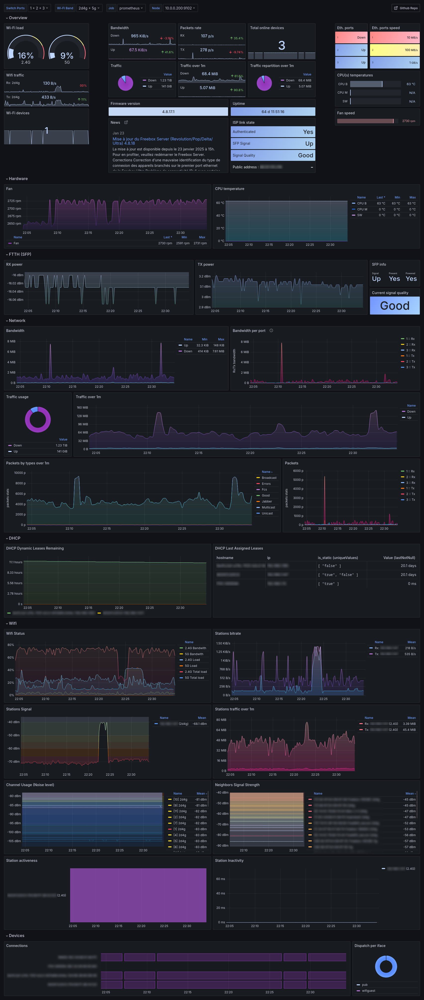

# freebox-exporter-rs

[](https://app.fossa.com/projects/git%2Bgithub.com%2Fshackerd%2Ffreebox-exporter-rs?ref=badge_shield)
[](https://matrix.to/#/#freebox-exporter-rs:matrix.org)
[](
https://discord.gg/QfV2D2KZ)

Yet another [Freebox API](https://dev.freebox.fr/sdk/os/) exporter for Prometheus! This project is actually in work in progress. New contributors are welcome!

> [!IMPORTANT]
> **Disclaimer:** This project is unofficial and is **not affiliated in any way with Free S.A.S. ISP nor Iliad Group**

## Grafana board

You will find on Grafana [gallery](https://grafana.com/grafana/dashboards/21957) the board for the exporter, also source file is located [here](./grafana-board.json)



## Features

* Adaptive Freebox metrics exposition (detects network mode, see: [related issue](https://github.com/shackerd/freebox-exporter-rs/issues/2#issuecomment-2234856496))
* Metrics caching & background update
* Customizable data directory
* Customizable metrics prefix
* Customizable log files retention
* Compressed log files
* Customizable/CLI overridable log verbosity
* CLI overridable configuration file path
* Freebox API certificate validation

## API Implementation

* &#10134; Authentication
  * &#9989; Register: **100%**
  * &#9989; Login: **100%**
* &#10134; Configuration
  * &#10134; Connection
    * &#9989; Status: **100%**
    * &#9989; Configuration: **100%**
    * &#9989; Configuration IPV6: **100%**
    * &#9989; xDSL: **100%**
    * &#9989; FTTH: **100%**
    * &#10060; DynDNS: 0%
  * &#9989; Lan: **100%**
  * &#9989; Lan Browser: **100%**
  * &#10060; Freeplug: 0%
  * &#9989; DHCP: **100%**
  * &#9989; Switch: **100%**
  * &#9989; Wi-Fi: **100%**%
  * &#9989; System: **100%**
  * &#10060; VPN Server: 0%
  * &#10060; VPN Client: 0%

## Enhancements

You can suggest your ideas in [discussion section](https://github.com/shackerd/freebox-exporter-rs/discussions/categories/ideas)

## Usage

You will find usage by using the following command `freebox-exporter-rs -h`

``` text
Usage: freebox-exporter-rs [OPTIONS] <COMMAND>

Commands:
  auto                starts the application and registers it if necessary
  register            registers the application
  serve               starts the application
  session-diagnostic  runs a diagnostic on the session
  revoke              revokes the application token
  dry-run             runs a dry run of the application and outputs the result to a file
  help                Print this message or the help of the given subcommand(s)

Options:
  -c, --configuration-file <CONFIGURATION_FILE>
  -v, --verbosity <VERBOSITY>
  -h, --help                                     Print help
  -V, --version                                  Print version
```

## Running project

Running with docker

``` bash
docker pull ghcr.io/shackerd/freebox-exporter-rs:latest
```

``` yaml
version: '3.8'

services:
  freebox-exporter:
    image: ghcr.io/shackerd/freebox-exporter-rs:latest
    container_name: freebox-exporter
    volumes:
      - ./config:/etc/freebox-exporter-rs
      - ./data:/data
    ports:
      - "9102:9102"
    restart: unless-stopped
    command: ["/usr/bin/freebox-exporter-rs", "-c", "/etc/freebox-exporter-rs/config.toml" ,"auto"]
```

> [!IMPORTANT]
> **port** must match with value set in your **configuration file**
> `data` volume path must match with `data_directory` value set in your **configuration file**

## Configuring

``` toml
[api]
# Refresh wait interval in seconds, application will send requests to the freebox host on each refresh iteration
# This does not affect prometheus scrap agents, application will use cached values between calls
# Remark:
#   more you set API exposition (c.f: [metrics] section) more requests will be sent,
#   setting a too low interval between refreshs could lead to request rate limiting from freebox host
refresh = 5

[metrics]
# Exposes connection
connection = true
# Exposes lan
lan = true
# Exposes lan browser, this option will be disabled if freebox is in bridge_mode
lan_browser = true
# Exposes switch, this option will be disabled if freebox is in bridge_mode
switch = true
# Exposes wifi, this option will be disabled if freebox is in bridge_mode or device is disabled on the host
wifi = true
# Exposes dhcp, this option will be disabled if freebox is in bridge_mode
dhcp = true
# Exposes system
system = true
# Sets metrics prefix, it cannot be empty
# Warning if you are using the exporter Grafana board, changing this value will cause the board to be unable to retrieve data if you do not update it
prefix = "fbx_exporter"

[core]
# Specify where to store data for exporter such as APP_TOKEN, logs, etc.
data_directory = "."
# Specify which TCP port to listen to, for the /metrics HTTP endpoint
port = 9102

[log]
# Specify which log level to use
# Acceptable values :
#   * "Off"     : A level lower than all log levels
#   * "Error"   : Corresponds to the `Error` log level
#   * "Warn"    : Corresponds to the `Warn` log level
#   * "Info"    : Corresponds to the `Info` log level
#   * "Debug"   : Corresponds to the `Debug` log level
#   * "Trace"   : Corresponds to the `Trace` log level
level = "Info"
# Specify how long application should keep compressed log files, value is in days
retention = 31
```

## Building, debugging

### Clone project

``` bash
git clone --recurse-submodules https://github.com/shackerd/freebox-exporter-rs.git && cd freebox-exporter-rs
```

### Run

``` bash
cargo run auto
```

The `auto` command will prompt the user to consent the application if needed, otherwise it will **serve** the metrics on http.

* See the `serve` command if you want to only serve the metrics.
* See the `register` command if you want to only register the application.

> [!TIP]
> You can change output log level by specifying verbosity, such as `cargo run -- -v Debug auto`

### Running tests

Run the following command.

``` bash
cargo test
```

### Verify it works

If you changed port in `conf.toml`, update the command line below.

``` bash
curl http://localhost:9102/metrics
```

## License

[](https://app.fossa.com/projects/git%2Bgithub.com%2Fshackerd%2Ffreebox-exporter-rs?ref=badge_large)

## Support this project

You like this project? Don't forget to leave a :star:!

If you want to help :heart:, you can contribute, give feedbacks or you can still [buy me a :coffee:](https://ko-fi.com/shackrd), i like coffee ☕.

## Useful links

* [https://dev.freebox.fr/blog](https://dev.freebox.fr/blog) : official Freebox blog
* [https://dev.freebox.fr/bugs](https://dev.freebox.fr/bugs) : official Freebox bugs report board
