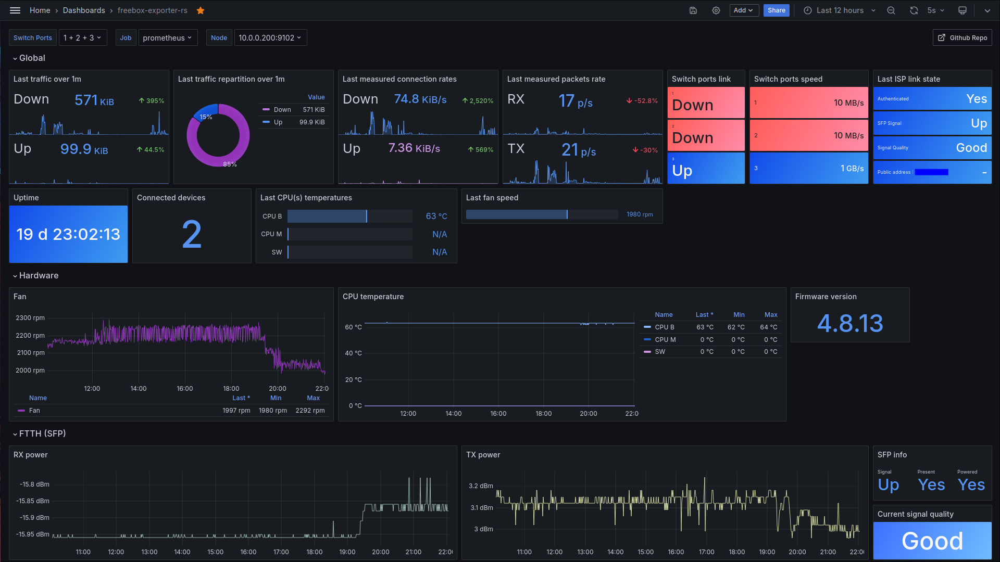
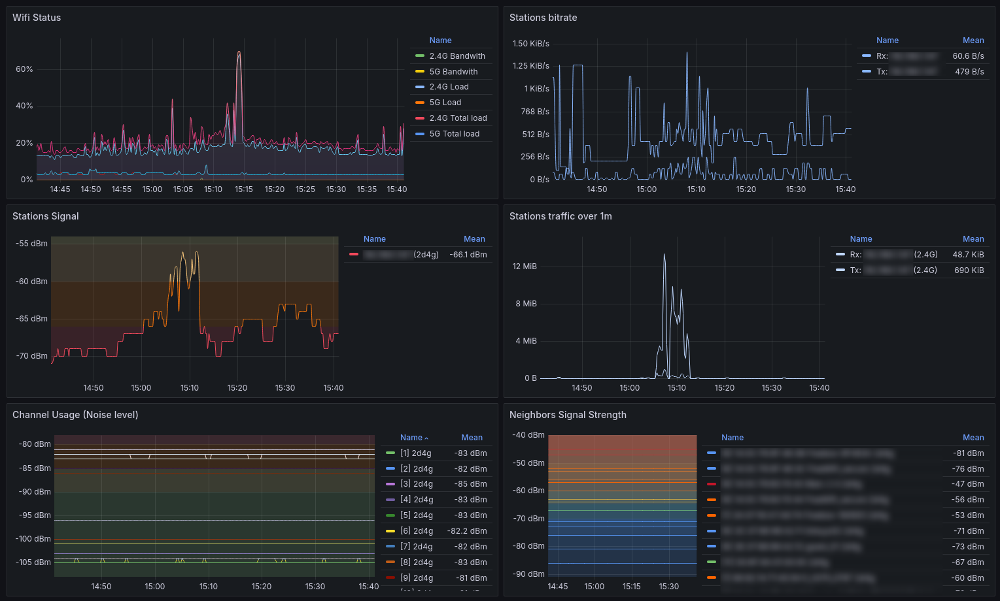

# freebox-exporter-rs

[](https://app.fossa.com/projects/git%2Bgithub.com%2Fshackerd%2Ffreebox-exporter-rs?ref=badge_shield)
[](https://matrix.to/#/#freebox-exporter-rs:matrix.org)
[](
https://discord.gg/QfV2D2KZ)

Yet another [Freebox API](https://dev.freebox.fr/sdk/os/) exporter for Prometheus! This project is actually in work in progress. New contributors are welcome! Please join our [Matrix room](https://matrix.to/#/#freebox-exporter-rs:matrix.org) and say *"hey!"*

> [!IMPORTANT]
> **Disclaimer:** This project is unofficial and is **not affiliated with Free S.A.S. ISP nor Iliad Group**

## Grafana board

You will find on Grafana [gallery](https://grafana.com/grafana/dashboards/21957) the board for the exporter, also source file is located [here](./src/grafana-board.json)





You will find [here](https://grafana.com/grafana/dashboards/21637) the original Grafana board for the exporter, thanks go to [@ottobaer](https://github.com/ottobaer)!

## Features

* Freebox metrics exposition
* Metrics caching & background update
* Customizable data directory
* Customizable metrics prefix
* Customizable log files retention
* Compressed log files
* Customizable/CLI overridable log verbosity
* CLI overridable configuration file path

## API Implementation

* &#10134; Authentication
  * &#9989; Register: **100%**
  * &#9989; Login: **100%**
* &#10134; Configuration
  * &#10134; Connection
    * &#9989; Status: **100%**
    * &#9989; Configuration: **100%**
    * &#9989; Configuration IPV6: **100%**
    * &#10060; xDSL: 0%
    * &#9989; FFTH: **100%**
    * &#10060; DynDNS: 0%
  * &#9989; Lan: **100%**
  * &#9989; Lan Browser: **100%**
  * &#10060; Freeplug: 0%
  * &#9989; DHCP: **100%**
  * &#10060; Ftp: 0%
  * &#10060; NAT: 0%
  * &#10060; Port Forwarding: 0%
  * &#10060; Incoming port configuration: 0%
  * &#10060; UPnP IGD: 0%
  * &#10060; Network Share: 0%
  * &#9989; Switch: **100%**
  * &#9989; Wi-Fi: **100%**%
  * &#9989; System: **100%**
  * &#10060; VPN Server: 0%
  * &#10060; VPN Client: 0%

## Not implemented, on-demand

* &#10134; Download
  * &#10060; Stats: 0%
  * &#10060; Files: 0%
  * &#10060; Trackers: 0%
  * &#10060; Peers: 0%
  * &#10060; Pieces: 0%
  * &#10060; Blacklist: 0%
  * &#10060; Feeds: 0%
  * &#10060; Configuration: 0%

* &#10134; File
  * &#10060; System: 0%
  * &#10060; Sharing Link: 0%
  * &#10060; Upload: 0%

* &#10060; Storage: 0%
* &#10060; Parental filter: 0%
* &#10134; PVR
  * &#10060; Programmed records: 0%
  * &#10060; Finished records: 0%
  * &#10060; Storage media: 0%

## Roadmap

* Speedtest metrics
* Provide systemd registration
* Publish to crates.io (cargo install)

You can suggest your ideas in [discussion section](https://github.com/shackerd/freebox-exporter-rs/discussions/categories/ideas)

## Usage

This project uses `clap` crate you will find usage by using the following command `freebox-exporter-rs -h`

``` text
Usage: freebox-exporter-rs [OPTIONS] <COMMAND>

Commands:
  register
  serve
  revoke
  help      Print this message or the help of the given subcommand(s)

Options:
  -c, --configuration-file <CONFIGURATION_FILE>
  -v, --verbosity <VERBOSITY>
  -h, --help                                     Print help
  -V, --version                                  Print version
```

## Running project

Running with docker

``` bash
docker pull docker.io/shackerd/freebox-exporter-rs:latest
```

``` yaml
version: '3.8'

services:
  freebox-exporter:
    image: docker.io/shackerd/freebox-exporter-rs:latest
    container_name: freebox-exporter
    volumes:
      - ./config:/etc/freebox-exporter-rs
      - ./data:/data
    ports:
      - "9102:9102"
    restart: unless-stopped
    command: ["/root/freebox-exporter-rs", "-c", "/etc/freebox-exporter-rs/config.toml" ,"serve"]
```

> [!IMPORTANT]
> **port** must match with value set in your **configuration file**
> `data` volume path must match with `data_directory` value set in your **configuration file**
> first time run, you may change the `serve` argument in the compose file to `register` and switch back to `serve` once app is authorized and **app token** has been created in **data** folder

## Configuring

``` toml
[api]
# Acceptable values: "router" or "bridge"
# These values will determine whether use discovery or not, see: https://github.com/shackerd/freebox-exporter-rs/issues/2#issuecomment-2234856496
# * discovery on:
#   * Traffic will be using host like xxxxxxxx.fbxos.fr
#   * FQDN resolves to your public IP address.
#   * However, you do not need to activate remote_access from local network to get API working.
# * discovery off:
#   * Traffic will be using host mafreebox.freebox.fr
#   * FQDN resolves to a public IP address (not yours), which allows you to reach your freebox API even if it's set to bridge mode.
# Remark:
#   * If the application is set in "bridge" mode, it works even when Freebox is set to "router" mode but some functionalities will be disabled
#   * If the application is set in "router" mode, it does not work when Freebox is set to "bridge" mode
mode = "bridge"

# Refresh wait interval in seconds, application will send requests to the freebox host on each refresh iteration
# This does not affect prometheus scrap agents, application will use cached values between calls
# Remark:
#   more you set API exposition (c.f: [metrics] section) more requests will be sent,
#   setting a too low interval between refreshs could lead to request rate limiting from freebox host
refresh = 5

[metrics]
# Exposes connection
connection = true
# Exposes lan, this option may not work in bridge_mode
lan = true
# Exposes lan browser, this option does not work in bridge_mode
lan_browser = true
# Exposes switch, this option may not work properly in bridge_mode
switch = true
# Exposes wifi
wifi = true
# Exposes dhcp
dhcp = true
# Sets metrics prefix, it cannot be empty
# Warning if you are using the exporter Grafana board, changing this value will cause the board to be unable to retrieve data if you do not update it
prefix = "fbx_exporter"

[core]
# Specify where to store data for exporter such as APP_TOKEN, logs, etc.
data_directory = "."
# Specify which TCP port to listen to, for the /metrics HTTP endpoint
port = 9102

[log]
# Specify which log level to use
# Acceptable values :
#   * "Off"     : A level lower than all log levels
#   * "Error"   : Corresponds to the `Error` log level
#   * "Warn"    : Corresponds to the `Warn` log level
#   * "Info"    : Corresponds to the `Info` log level
#   * "Debug"   : Corresponds to the `Debug` log level
#   * "Trace"   : Corresponds to the `Trace` log level
level = "Info"
# Specify how long application should keep compressed log files, value is in days
retention = 31
```

## Building, debugging

### Clone project

``` bash
git clone https://github.com/shackerd/freebox-exporter-rs.git && cd freebox-exporter-rs
```

### Run debug configuration, assuming application is registered on Freebox host

``` bash
cargo run serve
```

> [!TIP]
> You can change output log level by specifying verbosity, such as `cargo run -- -v Debug serve`

### Register application if application is not registered on Freebox host

``` bash
cargo run register
```

### Running tests

> [!TIP]
> This project uses [Mockoon](https://mockoon.com/) for API mocking, you need to install GUI or CLI and start it with `api-mock.json` file.

Then run the following command.

``` bash
cargo test
```

### Verify it works

If you changed port in `conf.toml`, update the command line below.

``` bash
curl http://localhost:9102/metrics
```

## License

[](https://app.fossa.com/projects/git%2Bgithub.com%2Fshackerd%2Ffreebox-exporter-rs?ref=badge_large)

## Support this project

If you want to help :heart:, you can contribute, give feedbacks or you can still [buy me a :coffee:](https://buymeacoffee.com/shackerd) or leave a :star:!

## Useful links

* [https://dev.freebox.fr/blog](https://dev.freebox.fr/blog) : official Freebox blog
* [https://dev.freebox.fr/bugs](https://dev.freebox.fr/bugs) : official Freebox bugs report board
